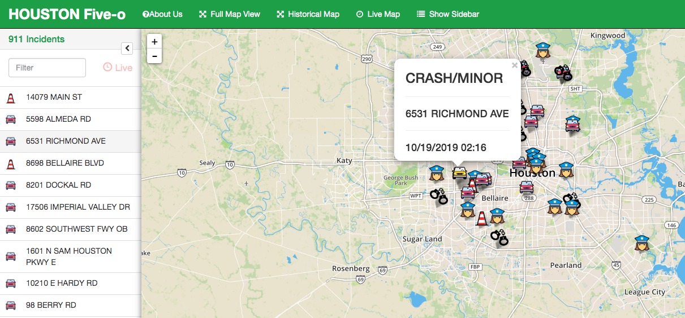
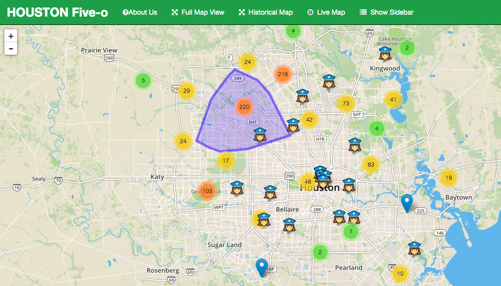

  

APP URL : https://live-crime.herokuapp.com/

**A web application for tracking live and archival data of crime activity in Houston, Texas.**
___

Houston is the fourth largest city in the US, and arguably the best city in Texas. It boasts a booming economy, amazing eateries, fast-paced nightlife and is one of the most culturally diverse populations in the United States. But all this comes with a price. When I place is as as Houston, the population booms, and where there are people there is crime.

Now there is a way to keep up with live and historic incidents of criminal and traffic activity in the Houston area- to help keep you safe and on time, whether you are going to your favorite food truck on Harwin at 2:00 am or searching for the perfect location for your new home or business.
___

**Data**

[HPD Live Incidents](https://cohweb.houstontx.gov/ActiveIncidents/Combined.aspx): 
This site showcases live traffic-related incidents in the city. It is updated on five minute intervals and is populated by Houston Central Command dispatch system.  The data is While the incidents includes data from the police department, fire department and EMS, we relied on the HPD response information only. This info was scrapped from the web.

[CrimeReports/Socata](https://moto.data.socrata.com/dataset/Harris-County-Sheriff-s-Office/p6kq-vsa3):
 This site is run by third party operator Socrata with information provided by the Harris County's Sheriff's Department. It is updated everyday but the data is for the last 24 hours of criminal activity. For this site, we composed a CSV file and also used their API (json) for data.
 
[Houston Police Stations](https://cohgis-mycity.opendata.arcgis.com/datasets/houston-police-stations):
	The City of Houston GIS Open Data Portal, this was fixed information, and we pulled a CSV file of this data. It also provided the station's beats and district information.
  
[Houston PD News Releases](https://www.houstontx.gov/police/news.htm):
	News releases published by the Houston Police Department Public Affairs Division. This data was web-scrapped as well.  
___ 

**Competencies**
* Web Scrapping
* APIs
* CSV
* Leaflet
* Plotly
* Flask
* Heroku
* MongoDB Atlas

**Overview**

### Our Maps
___ 

#### Live Map

___ 

#### Historical Map

